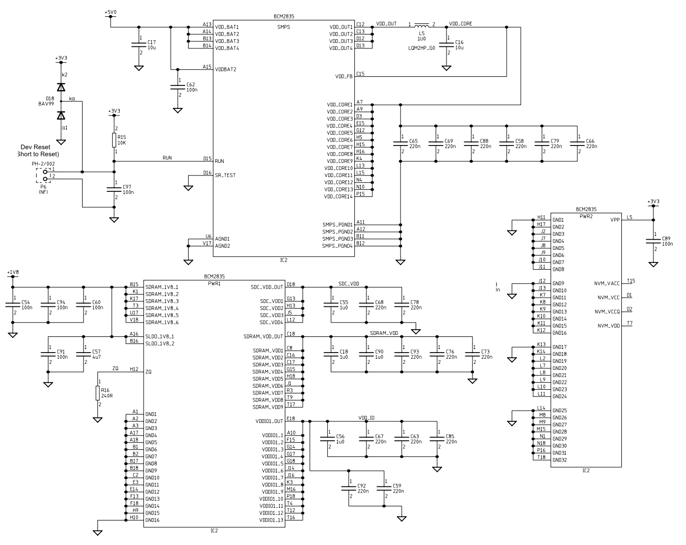
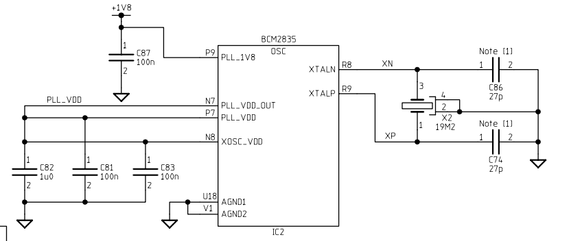
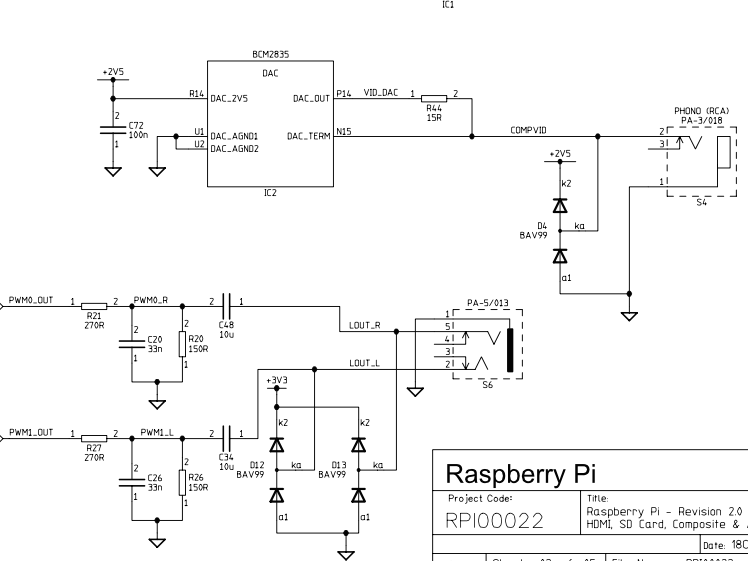
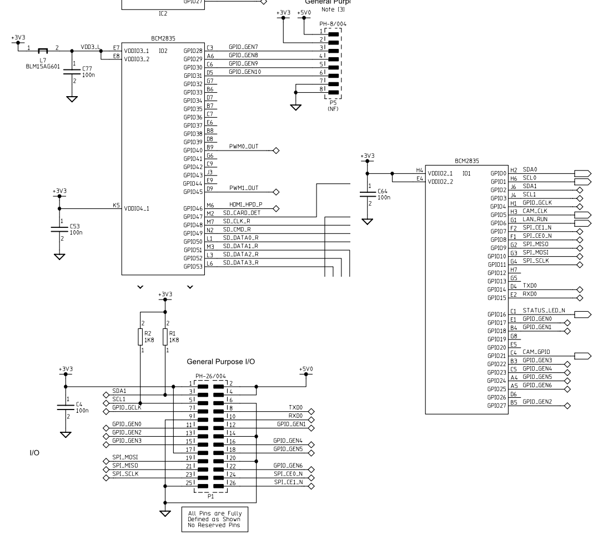
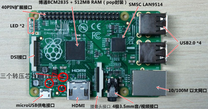
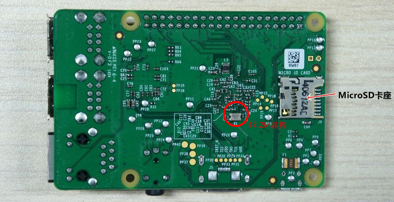

# 树莓派硬件系统
在上一章节中，简单的介绍了树莓派及各版本树莓派参数的对比。这一章节会重点介绍树莓派的硬件系统（树莓派的 CPU 架构将会在 AMR 章节中讲述）。首先，我们会直接介绍树莓派的原理图。然后在拿一款真实的树莓派，简单的看看在电路图中的各组成部分。

## 供电系统及振荡电路

上面这个看起来很复杂的几个电路，其实只做了一件事，就是给系统芯片（BCM2835）供电。可以看到所有管脚只连接到了 VCC（5v、3.3v、1.8v）和 GND。其中一些管脚还需要做些限流，限压等，接了一些电容，电阻及电感等。然而硬件工程师并不需要自己去计算这些元件的参数，因为芯片厂商在设计每款芯片时，都会设计这些外围电路，并在芯片手册中附上最佳电路图。而使用这些芯片的硬件工程师只需要画 PCB 版的时候设计如何布局及连线。

上图左边的是usb供电电路，右边是转压电路，这两个电路在所有的硬件设计中都是比较简单和常用的电路。左边图中2、3、4三个关键是 usb 的数据及主从控制管脚，一般 usb 都有是四个或五个管脚（其中两个为电源和地，另外两个为数据读写，还有一个可以作为主从控制，复杂的 usb 集群通信可以用到）。这里没有画出它们的连接。右边图主要用了 NCP1117-3v3、LP2980-2v5、NCP117-1v8 三款芯片将5v分别转化成3.3v，2.5v及1.8v。从在上一张图中可以看出，系统芯片出来需要5v，还分别需要1.8v及3.3v(很多芯片都是5v或3.3v供电)，单从上一张图中并没有看出为什么会转一个2.5v的电压出来。

上面的这个看似不起眼的电路其实就是整个系统的心脏，可以看到途中有 osc 的字母，osc 是英文字母 oscillator (振荡器)的缩写，MCU (微控制器)中通常对应的为晶振。振荡器主要作用是将直流电能转换为具有一定频率的交流电能的一种装置。而晶振的作用也就是将直流转化成频率，因为 MCU 工作时，是一条一条地从 ROM 中取指令，然后一步一步地执行。单片机访问一次存储器的时间，称之为一个机器周期，这是一个时间基准。一个机器周期包括12个时钟周期，而晶振就是提供这个时间基准。我们通常可以由所选的晶振频率计算出一个机器周期的时间，对应到汇编语言语言中，大概就能估算到一段代码的执行时间。图中的 19.2MHZ，那么一个时钟周期就是 12/19.2（0.625）微秒。这里也可以理解为什么不选用 19MHZ的晶振频率了，因为选用 19MHZ 作为晶振频率时，将会得到一个无限不循环小数的时钟周期，不利与计算。

## PWM及DAC

上图是 DAC（数字模拟转换器）电路，DAC 是英文单词 Digital to Analog Converter 的缩写。在很多数字系统中（例如计算机），信号以数字方式存储和传输，而数字模拟转换器可以将这样的信号转换为模拟信号，从而使得它们能够被外界（人或其他非数字系统）识别，从这张图中可以看到上面的 2.5V 电压的用处，这里的 2.5V 是作为输入的基准电压。与 DAC 对应的还有 ADC ，顾名思义，ADC 的作用是将模拟信号转化为数字信号。很多传感器输出的事模拟信号，而MCU无法读取模拟信号，只能通过 ADC 将模拟信号先转化为数字信号，再进行读取。在选择传感器（如加速度、重力等传感器），这些传感器一半都有数字传感器或模拟传感器，数字传感器往往比模拟传感器精准。PWM 是英文单词 Pulse Width Modulation（脉冲宽度调制） 的缩写。脉冲宽度调制是利用微处理器的数字输出来对模拟电路进行控制的一种非常有效的技术，广泛应用在从测量、通信到功率控制与变换的许多领域中。最典型的例子就是用 PWM 控制电机转速，而目前市面上的多数 MCU 都带有 PWM 模块。51等传统单片机是没有 PWM 模块的，往往可以通过程序模拟，或外接 PWM 模块支持。

## GPIO

GPIO 是英文单词 General Purpose Input Output（通用输入/输出）的缩写。对于程序员来说，GPIO 应该是我们接触最多也最熟悉的部分了。控制外接电路，往往是连接 GPIO 管脚。使用树莓派，无论用 node、python、C# 或者是其他语言，往往都会引用一个 GPIO 的库来进行控制，而这些库往往又是基于 C 或 C++ 进行的底层操作。不引用第三方库，直接用 C 对这些管脚进行控制也是相当简单的。比如，硬件领域的 “hello world”（点亮 LED 灯），只需要对一个管脚写入0或1，便可控制 LED 亮灭。上面第一张图可以注意到，很多管脚是具有第二功能的，比如上面的两路输出 PWM 的管脚以及 SD 卡相关的管脚。下图中有两个管脚需要格外注意，TXD 及 RXD 这是串口通信的管脚，串口通信对应的还有并口通信，串口通信相比较并口通信的优势就是在于拿时间换取空间。

## SD卡

从上面的图可以看到需要操作的管脚是4、5、2、7、8、9、1几个管脚。SD的这个电路为通用的电路，换其它MCU时，这种连接依然可以work.

## HDMI、音频、网卡电路
HDMI和音频是系统芯片内部的功能，主要按照数据手册里方式的进行连接。该图也较为复杂，就没有必要贴出来了。网卡及串口在树莓派中借助的是 LAN9512 芯片，Microchip公司生产的 LAN9512/LAN9512i 是第一款工业的全集成、高速2.0 USB、高性能10/100M网络控制器。具体的电路连接也是需要阅读 LAN9512 的数据手册。

## 树莓派正面

上面位于正中心的那块是这个系统的核心芯片 BCM2835，左边为 LAN9154，布局的规则也决定，网卡接口及USB接口设计在了 LAN9154 的右边。USB供电系统旁边有三个转压芯片，这一部分区域是给系统提供4种电压。树莓派为双层板，正面布满系统需要的绝大部分元器件。

PCB 板反面右边是SD卡接口，中心是一个19.2MHZ的晶振，对应正面中心的 BCM2835 芯片。
