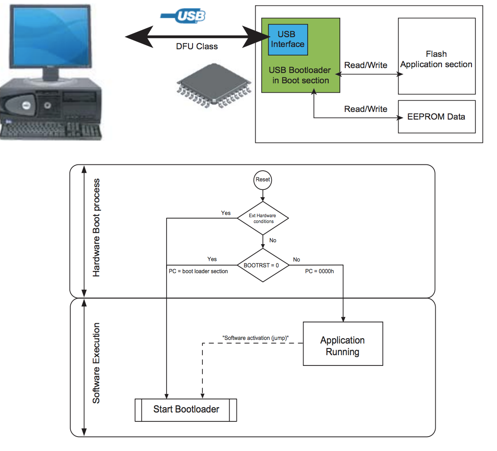

# 选用那种语言
现如今，绝大多数嵌入式设备选用的是 C/C++ 语言，对于一些实时性较高的语言则选用汇编语言。但是随着硬件设备的性能提升，越来越有可能选用自己熟悉的语言进行编程，比如java、C#、javascript、python等。目前，在一些高端的微处理器（如树莓派）上已经可以使用这些语言进行编程，大多数 MCU （绝大多数8/16位芯片）的编译环境都是将 C 语言编译成16进制文件烧录到芯片中执行。所以，当选用一个自己熟悉的语言在低端芯片中编程时，可能无法借助现有的编译器完成。本文以 Ardunio UNO （8位芯片）为例，用 Javascript 编写一个硬件的“Hello World”（点亮LED）程序。

## 下载程序 
MCU 下载程序需要软硬件共同支持，一般会使用现成的 IDE 工具，极少会关注到这些。那么将一段程序下载到 MCU 中需要哪些支持呢？这里以 Ardunio UNO 为例进行讲解。将一段程序下载到 Ardunio UNO ，Ardunio UNO 依靠 ATmega32U4/ATmega16U2（不同版本的 UNO 使用的芯片不同，高版本的有所升级）等 进行下载。而 ATmega32U4/ATmega16U2 等是 USB 接口芯片，是将 PC 发送的信号传递到 UNO 主芯片的中枢。从第一章的电路图可以看出，ATmega16U2 芯片可以将 USB 信号转换为 ISP、串口信号等，而这里是将其转化为串口信号下载到主芯片（不同厂商、不同芯片支持不同的下载方式）。另一方面，不同平台电脑也会装上对应的驱动（第一章安装环境中有提到），ATmega16U2 内置  Bootloader ，按照特定的协议与 PC 通信。这里特别提一下，ATmega16U2 系列芯片支持固件升级，需要借助官方提供的软件[Flip](http://www.atmel.com/tools/flip.aspx)对其升级，对应的固件[megaUSB_DFU_Bootloaders](http://www.atmel.com/Images/megaUSB_DFU_Bootloaders.zip)都是16进制文件。下图是 ATmega16U2 等硬件及 Boot 处理流程：



## JS点亮LED
Arduino IDE 是不支持 Javascript 语法的，这里无法使用 Arduino IDE 进行 Js 编程。首先，需要用 js 编写程序，然后将 js 程序写入到 arduino 中。这里需要一个协议来支持 PC 与 MCU 的通信。而 Arduino IDE 本身集成 [Firmata 协议](http://firmata.org/wiki/Main_Page)(准确的说是 Firmata 从 Aduino 抽离出来的)。这里首先需要做的事讲 Firmata 协议的 Arduino 实现烧写到芯片中。然后，用 js 实现 Firmata 协议，PC 通过 Firmata 协议控制 Arduino.

### 烧写Firmata协议
Arduino IDE 本身是集成了 Firmata，只需要找到这个程序，烧写到 arduino 中即可，具体位置如下图：


### PC端程序
首先，要实现 PC 与 MCU 的 Firmata 协议，这里直接借助 [firmata.js](https://github.com/firmata/firmata.js)，firmata.js 实现了用 PC 端用 js 与 MCU 的 Firmata 通信。在这个基础上，编写“Hello World”。连接 USB 线，找到对应的设备端口```ls /dev/tty.usb*```：


编写程序，当 PC 和 MCU 与连接成功之后，将 Arduino 的13（连接LED）管脚置为高电平。将刚才显示的设备端口写到以下程序中：

```
var Board = require("firmata");
var board = new Board("/dev/tty.usbmodem1421");

board.on("ready", function() {
  // Arduino is ready to communicate
 console.log('connet');
 board.digitalWrite(13, 1)
});                                                                                       
```

如图，连接成功，开发板 LED 点亮：


上面就实现了用 js 控制硬件，当想用 js 编写复杂的程序是，也可以依赖一些现成的 js 库，这里推荐一个 [johnny-five](https://github.com/rwaldron/johnny-five)。同样，用其他的语言也可以实现，只需要使用 Firmata 对应的实现。[Firmata client libraries](https://github.com/firmata/protocol)，这个文档中列出各种语言对 Firmata 实现的库。


