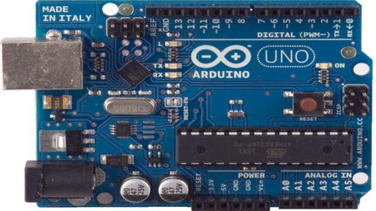
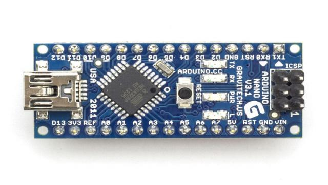
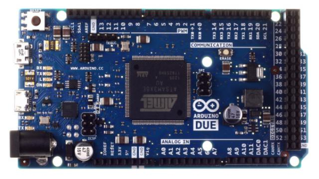
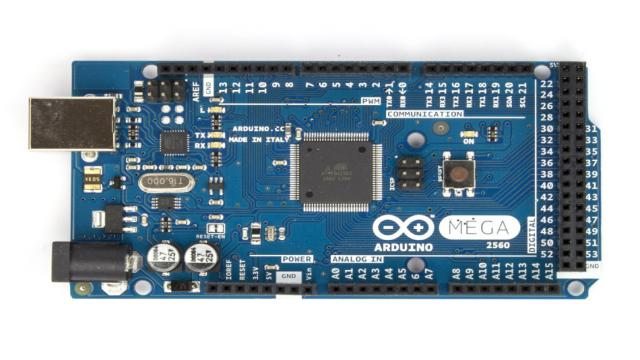
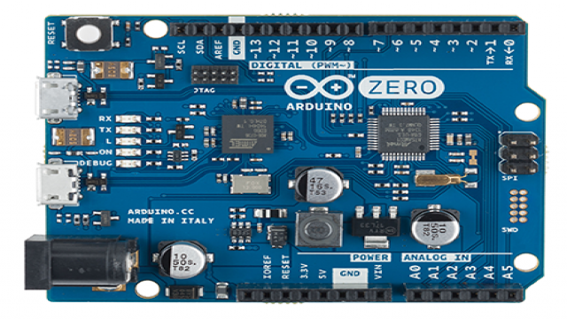
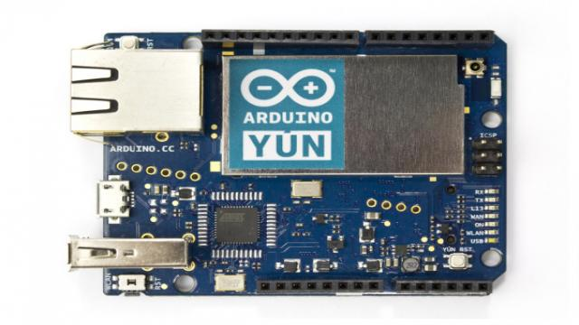
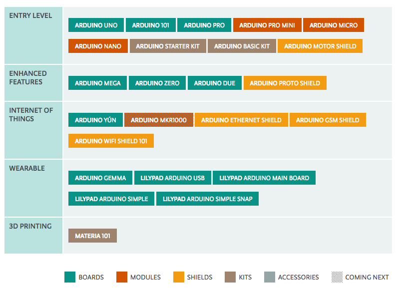

# Ardunio
Arduino 是一款比较流行的开源硬件，相对于传统的硬件平台，Arduino所具有的优势就是采用 Creative Commons 许可。 Creative Commons（CC）是为保护开放版权行为而出现的类似GPL的一种许可（license）。在 Creative Commons许 可下，任何人都被允许生产电路板的复制品，还能重新设计，甚至销售原设计的复制品。Ardunio 其实是包含硬件部分（各种型号的Arduino板）和软件部分（Arduino IDE)。

## Arduino板
Ardunio 开发板众多，仅主板就有各种系列，还有各种对应扩展板和传感器。Ardunio 基本都是采用 Atmel 公司的16位及32位芯片。下面是几款主要的Ardunio 发板：

### Arduino Uno

广受青睐的 Arduino Uno 开发板是以 ATmega328 MCU 控制器为基础。而 ATmega328 是一款低功耗，高性能的 AVR® 8位微处理器，这款芯片采用的是精简指令集计算机（RISC）架构，4/8/16/32K
字节系统内可编程闪存。Arduino Uno 开发板所具有的特性都是来自于 ATmega328 这款芯片。更多特性可以查看 [ATmega328官方数据手册](http://www.alldatasheet.com/view.jsp?Searchword=ATMEGA328)。

### Arduino Nano

Arduino Nano 是一款基于 ATmega328(Arduino Nano 3.x) 或 ATmega168(Arduino Nano2.x)的开发卡，体积小巧、功能全面且适用于电路板。

### Arduino Due

与前两款不同，Arduino Due 是基于 ATSAM3X8EA 芯片。而 ATSAM3X8EA 是32位 ARM Cortex-M3 RISC 处理器，Cortex－M3 处理器采用 ARMv7-M 架构。更多细节可以查看[ATSAM3X8EA](http://html.alldatasheet.com/html-pdf/475970/ATMEL/ATSAM3X8EA-AU/318/2/ATSAM3X8EA-AU.html).

### Arduino Mega(2560)

Arduino Mega 采用 ATmega2560 作为核心处理器。ATmega2560 是一款256K字节系统内可编程闪存的微处理器，这里不再做过多介绍，更多内容可以看[数据手册](http://html.alldatasheet.com/html-pdf/107092/ATMEL/ATMEGA2560/153/1/ATMEGA2560.html)

### Arduino Zero

Arduino Zero 采用的 SAMD21 作为主控制器，而SAMD21 是32位ARM Cortex M0+ 内核，CortexM0 其核心架构为 ARMv6M，关于 ARM 架构会在 ARM 章节进行讲解。Arduino Zero 是 Atmel 与 Arduino 合作推出 Zero 开发板，它是一款简洁、优雅、功能强大的32位平台扩展板。附上[SAMD20手册](http://html.alldatasheet.com/html-pdf/554411/ATMEL/ATSAMD20E14A-AU/322/2/ATSAMD20E14A-AU.html)

### Arduino Yún

ArduinoYún的比较独特，采用了 ATmega32U4 处理器，同时还带有 AtherosAR9331（wifi模块），而主芯片则和 Arduino Leonardo 相同。不同的是Yún板具备内置以太网和Wi-Fi支持器，Yún还可以与板上Linux分配通信，Arduino带来了功能强大的联网计算机。

以上是 Ardunio 的系列产品，除此之外还有很多已经废弃的产品，更多 Ardunio 产品看查看[Arduino Products](https://www.arduino.cc/en/Main/Products)

## Ardunio IDE
Ardunio IDE 同时支持 windows、linux、mac 三种平台，适用于任何 Ardunio 板。具体安装和使用方法可以参照官方[Getting Started with Arduino](https://www.arduino.cc/en/Guide/HomePage)， Ardunio IDE 提供了自己特有的[语法](https://www.arduino.cc/en/Reference/HomePage).很多人喜欢用 Sublime Text ，没有关系，安装 Ardunio 的插件，和 Ardunio IDE 具有的功能类似。以下是 Ardunio IDE 的界面：

