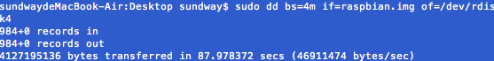
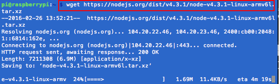

# 树莓派软件系统
树莓派和其它MUC一样，可以直接以汇编或C语言进行编程，在编写一些简单的程序时，是不会有什么问题的。编写复杂的程序，这样显然会更加吃力。而且学习成本也高，往往我们需要关心的不是用何种语言去编程，而是不要管底层驱动。跟树莓派装上操作系统，便可以解决这些问题。树莓派官方提供了很多可选的[系统镜像](https://www.raspberrypi.org/downloads/)，这里会以两款比较流行的系统，树莓派官方系统Raspbian及win10 iot进行安装学习。

## mac下安装Raspbian

windows下有现成的工具可用，所以windows下其实更简单，但手头没有可用的windows系统，就用mac给树莓派装系统。
### 下载镜像
可以到树莓派[官方下载地址](https://www.raspberrypi.org/downloads/)，下载镜像。我选择Raspbian，官方的一个操作系统。
### 安装系统
* 将SD卡插到电脑上，输入```df -h```查看已经挂在的卷。（可以找到我们的SD卡在系统里对应的设备文件）
* 使用```diskutil unmount```将这些分区卸载。(如我的SD卡在系统里对应的设备文件/dev/disk4s1，则需要使用‘’‘diskutil unmount /dev/disk4s1将SD卡分区卸载。)
* 再使用```diskutil list```确认/dev/disk4s1已被卸载。
* 使用dd命令将系统镜像写入。
  * ```dd bs=4m if=2016-02-09-jessie-raspbian.img of=/dev/rdisk4｀```

SD系统写入成功。



#### PS:

* 系统镜像分‘Full desktop image’和‘Minimal image based on Debian Jessie’，我安装的是前面的，太大了，以至于32G的SD不够用，开发的还是建议按装lite版本。
* 如果第一次安装树莓派，外接显示器可能无法连接，需要修改配置文件config.txt里的参数

```
hdmi_safe=1 //取消注释
config_hdmi_boost=4 //取消注释
``` 
### 连接树莓派
采用ssh的方式连接树莓派，mac下下了一个Ip Scanner查看局域网里设备ip地址。找到Raspberra pi的ip地址。


树莓派默认的账户: pi，密码：raspberry。（之前的操作系统必须先链接显示器，用键盘确认），ssh首次登录会生成密钥，选择yes,连接```ssh pi@ip```,输入密码，登录成功。


由于我的系统时重装的，所以登录时会报错。本机直接输入```ssh-keygen -R hostname```重新生成密钥即可。


### 安装nodejs
因为项目时基于node开发的，所以只需要装一下node即可。树莓派使用的架构用的架构是ARMv6，所以需要下载一个ARMv6版本的node，linux下下载命令``` wget https://nodejs.org/dist/v4.3.1/node-v4.3.1-linux-armv6l.tar.xz ```



等待下载，家里网速太慢。。。

下载成功之后需要解压.xz文件，先```xz -d xxx.tar.xz```将xxx.tar.xz解压成xxx.tar。然后，再用 ```tar xvf xxx.tar```来解包


由于node已经编译过了，不需要在本地编译了，直接使用即可，done.

### 测试Demo


Done，环境搭建完成。