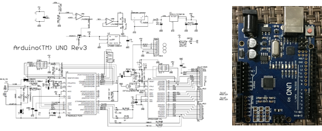
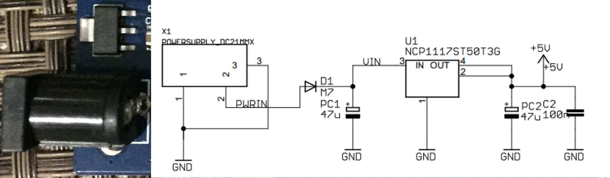
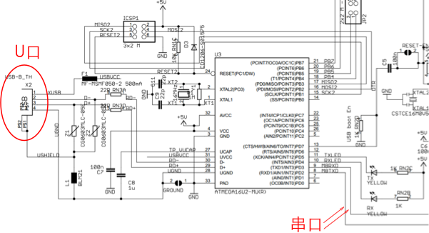
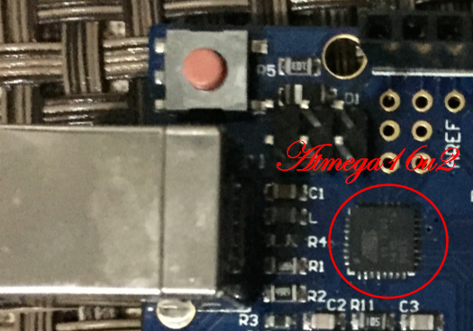
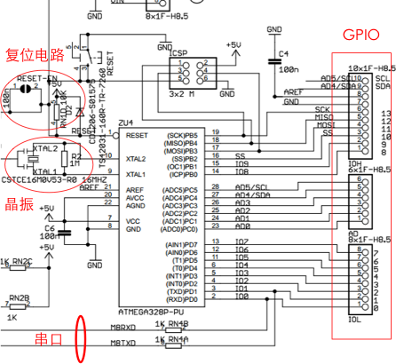
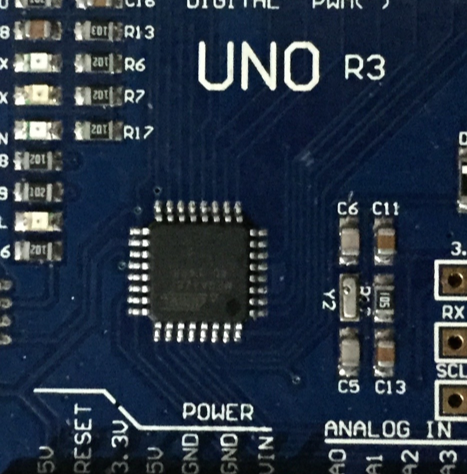

# Arduino UNO硬件介绍

本想在这一章会对照开发板简单讲解一下硬件原理图，所以如果你想深入了解硬件原理图，这里附上官网的[PDF版](https://www.arduino.cc/en/uploads/Main/Arduino_Uno_Rev3-schematic.pdf) 。下图是一张原理图和开发板的概览图：

## 稳压电路

外接电源输入进来的电压可能在5V附近，为了保证更加精准的5V电压，防止电压过高穿透芯片。这里选用的是 NCP117ST50T3G 稳压芯片，这款稳压芯片输出电压可调范围是1.5-12V。稳压电路的连接方式及计算公式可查[此链接](http://html.alldatasheetcn.com/html-pdf/174874/ONSEMI/NCP1117ST50T3G/1826/8/NCP1117ST50T3G.html)。

## 下载电路

这块 UNO 板采用 Atmega16U2 芯片做下载电路，一般我们可能需要单独的下载模块下载程序，但此开发板直接将下载电路集成到了开发板上。这里直接可连 USB 线进行下载，像 Ardunino mini 这种小系统板是需要单独的下载模块的。

## 主芯片最小系统

如上图，这里可以独立出 UNO 的最小系统板，我们编程最关心的就是这个最小系统的 GPIO 接口。晶振的选择几个元器件的选择可参考 Atmega328 数据手册。下图是我们经常操作的一些管脚，比如，我们下一章节将要用的的开发板中的13管脚，它对应的是芯片的19管脚，B端口的第五个管脚，而除了作为普通的 IO 管脚外，它的第二功能就是SCK（同步时钟），SPI通信中作为时钟信号。

