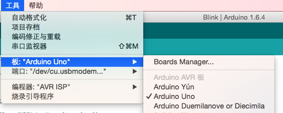
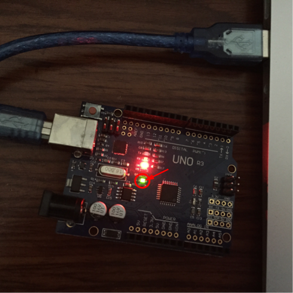

# 点亮LED灯

上一节介绍了 Ardunio UNO 的硬件结构，这一节将会写一个 UNO 的 “hello word” 程序，在软件领域通常会以输出 “hello word” 作为开始，而在硬件领域通常是以点亮 LED 灯作为开始。

## 搭建环境
首先，在编写程序之前，需要下载编译环境和安装驱动。这里以mac为例，具体的下载过程可以参考官方的[Getting Started w/ Arduino on Mac OS X](https://www.arduino.cc/en/Guide/MacOSX)。从官方下载IDE时可能需要先捐献才能下载，为了表示对IDE的支持，我捐献了两美元。当然如果你没有信用卡或者其他的合适的支付手段，这里提供一个第三方的[下载平台](http://www.maczapp.com/arduino)。按照上述方法安装完毕之后，需要再安装串口驱动，[下载链接](http://www.ftdichip.com/Drivers/VCP/MacOSX/FTDIUSBSerialDriver_v2_2_18.dmg)。驱动安装完毕之后，可以检查驱动是否安装成功。插上连接线，输入```ls /dev/tty.*```


这里是“/dev/tty.usbmodem1421”，驱动安装成功。

## 更改配置
在编写程序之前，还需要更改一些配置项：

第一步，选择对应的开发板，这里选用的是 UNO 开发板。



第二部，选择对应的下载端口，上面打印的端口是“/dev/tty.usbmodem1421”，这里选择它。


## 编写程序
Ardunio 采用自己的一套语言规范，程序可以被分解为三个主要部分：结构、值（变量和常量）以及函数。
一般结构中包含两个函数：“setup()”、“loop()”。“setup()” 是在“sketch”开始时被调用的，用于初始化变量、管脚、开始使用库文件等等。这个函数只会在开发板上电或复位时被调用一次。而“loop()”函数则是在“setup()”函数执行完毕后，一直循环执行。点亮 LED 的思路是只需要在程序开始时，将 LED 置于点亮状态。上一章可以看到，UNO 开发板的13管脚连接在 LED 的灯的一端，而 LED 的灯另一端连接到了低电平，也就是说，只需在初始化时，给13管脚上赋上高电平便可完成操作。

```
// the setup function runs once when you press reset or power the board
void setup() {
  // initialize digital pin 13 as an output.
  pinMode(13, OUTPUT);
  // turn the LED on (HIGH is the voltage level)
   digitalWrite(13, HIGH);
}

// the loop function runs over and over again forever
void loop() {
    
}
```

编译下载到 UNO 板中，Done，效果如下：

